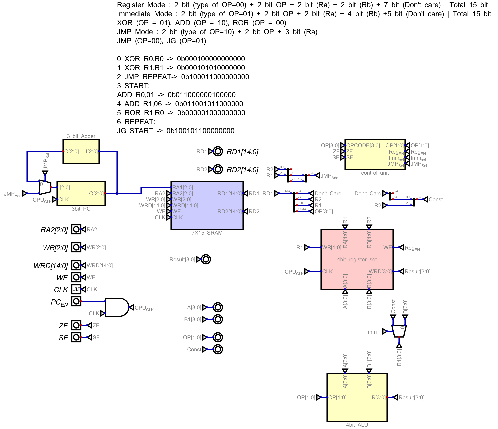

# Building_CPU
The Custom CPU Design Project utilizes JRE version 8u361 for Windows (64-bit) and Digital(A software application) to develop a unique CPU architecture. This CPU features a 4-bit word size and supports XOR, ADD, and ROR operations within its ALU. It is equipped with four registers and 7 units of RAM, both with a 15-word size for ISA and RAM. The architecture accommodates Register Mode, Immediate Mode, JMP (jump), and JG (jump if greater) instructions, highlighting its capability for diverse operational modes.

